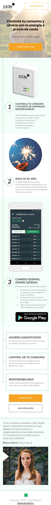
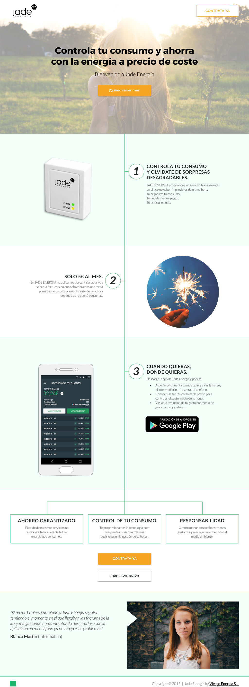

# Jade Energia | Landing4

> Landing Page, test A/B

----
## What is Jade Energy Landings?

> Jade Energy is an energy management company planning its launch. I developed four different landing pages to perform acceptance test A/B. A bootstrap framework based, fully responsive, HTML5 and CSS3.

----
## Go to the projects
You can see those four projects live going to: 

>* [Landing1](https://margaomar.com/en/jadeEnergia/Landing1/index.html) 
>* [Landing2](https://margaomar.com/en/jadeEnergia/Landing2/index.html) 
>* [Landing3](https://margaomar.com/en/jadeEnergia/Landing3/index.html) 
>* **[Landing4](https://margaomar.com/en/jadeEnergia/Landing4/index.html)**

----
## Media Query Mobile First Break Points

>425px

>1024px

----
## Device Screenshots
**Mobile Device**

----

**Desktop Device**

----
## Date
>* Nov-2015

----
## Company
>* Jade Energy

----
## Agency
>* [FikStores](https://thefik.com)

